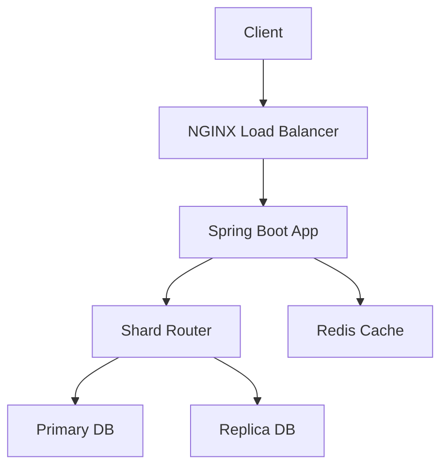

---

# 🚀 URL Shortener Backend — Scalable System Design

> A production-style URL shortener built with **Spring Boot**, focused on **scalability, performance, and real-world system design**.

💡 This project goes beyond CRUD by implementing:

* Database **sharding**
* **Read replicas**
* Redis caching with **LFU eviction**
* **Distributed ID generation**

---

# 🧠 System Architecture



---

# ⚙️ Core Features

### 🔗 URL Shortening

* Converts long URLs into short codes
* Stored in distributed DB
* Designed for scalability

---

### 🔁 Redirection

* Resolves shortCode → original URL
* Uses Redis for ⚡ low-latency lookup

---

### 📊 Analytics

* Tracks click counts
* Stored with TTL (auto-expiring)

---

# 🗄️ Database Architecture (PostgreSQL)

---

## 🧩 Sharding (Horizontal Scaling)

```text
shard = hash(shortCode) % shardCount
```

✔ Even distribution
✔ Scales with traffic

---

## 🔁 Primary–Replica Model

```text
Primary → Writes
Replica → Reads
```

### 🚀 Why this matters:

* Faster reads
* Reduced DB load
* Better scalability

---

## 🔀 Read/Write Routing

| Operation | Annotation                        | DB      |
| --------- | --------------------------------- | ------- |
| Write     | `@Transactional`                  | Primary |
| Read      | `@Transactional(readOnly = true)` | Replica |

👉 Handled via `ShardRoutingDataSource`

---

## ⚡ Connection Pooling

* HikariCP used
* Separate pools per:

  * shard
  * role (primary/replica)

---

## 🧱 Schema Management

* Flyway migrations
* Runs per shard
* Keeps schema consistent

---

# ⚡ Redis Caching Layer

---

## 🔄 Cache Flow (Cache-Aside)

```text
1. Check Redis
2. If miss → DB
3. Store back in Redis
```

---

## 🗂️ Stored Data

```text
url:{shortCode}     → original URL
clicks:{shortCode}  → analytics
rate:{ip}           → rate limiting
```

---

## ⏳ TTL Strategy

| Data       | TTL    |
| ---------- | ------ |
| URL        | 24h    |
| Clicks     | 7 days |
| Rate Limit | 60 sec |

---

## 🔥 Eviction Strategy

```text
volatile-lfu
```

### 🧠 Meaning:

* Only TTL keys are evicted
* Least Frequently Used removed first

---

## 💡 Why LFU (important)

```text
Few hot links 🔥
Many cold links ❄️
```

👉 LFU keeps hot links fast
👉 Removes rarely used ones

---

## ⚙️ Advanced Redis Tuning

* `lfu-decay-time` → popularity decay
* `lfu-log-factor` → frequency precision

👉 Makes cache smarter over time

---

# 🚦 Rate Limiting

* Redis-based
* Per-IP tracking
* Prevents abuse

---

# ⚡ Distributed ID Generation

## 🆔 Snowflake Algorithm

* Unique IDs without DB
* Works across distributed systems

---

# 🌐 Load Balancing

## ⚖️ NGINX

* Reverse proxy
* Supports:

  * Round Robin
  * Least Connections

👉 Enables horizontal scaling

---

# 🧠 Shard Routing Internals

---

## 🧵 ShardContext (ThreadLocal)

* Stores shard per request
* Prevents cross-request bugs

---

## 🔀 Routing Logic

```text
1. Hash shortCode → shard
2. Check transaction type
3. Route to primary/replica
```

---

# 📊 Observability & Logging

---

## 📌 Request Logs

```text
method, path, status, latency, IP
```

---

## 📌 DB Routing Logs

```text
SHARD_DECISION
ROUTING → primary/replica
```

---

## 📌 Cache Logs

```text
cache hit / miss
```

---

# 📦 Infrastructure

---

## 🐳 Docker-based Setup

* PostgreSQL (Bitnami replication)
* Redis
* Custom network

### 🎯 Benefits:

* Consistent environment
* Easy scaling
* Production-like setup

---

# 🧠 Design Decisions

---

### Why Sharding?

→ Avoid single DB bottleneck

---

### Why Replicas?

→ Faster reads

---

### Why Redis?

→ Reduce DB hits

---

### Why LFU?

→ Keeps popular URLs cached

---

### Why Snowflake?

→ Distributed ID generation

---

# 💣 Key Highlights

* ✅ Horizontal scaling (sharding)
* ✅ Read scaling (replicas)
* ✅ Smart caching (LFU)
* ✅ Rate limiting
* ✅ Distributed IDs
* ✅ Docker-based infra

---

# 🧠 One-Line Summary

```text
Built a scalable URL shortener using sharded PostgreSQL with primary-replica architecture, Redis caching with LFU eviction, and distributed ID generation for efficient read/write separation and high performance.
```

---

# 👨‍💻 Author

Meet Sinojia

---
